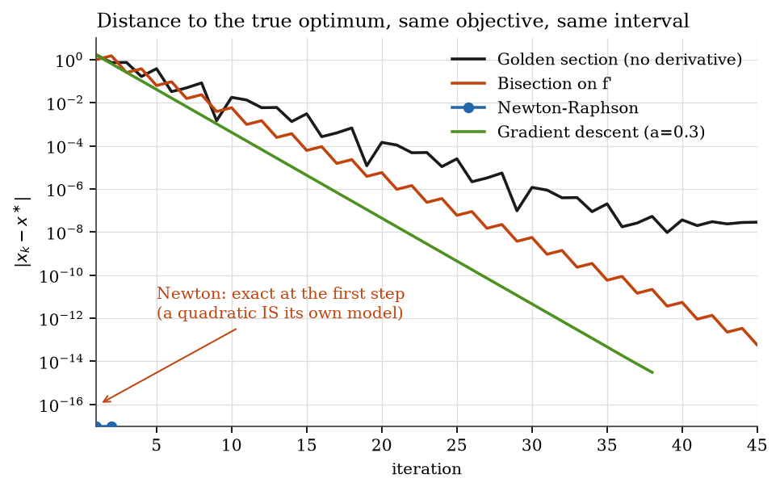
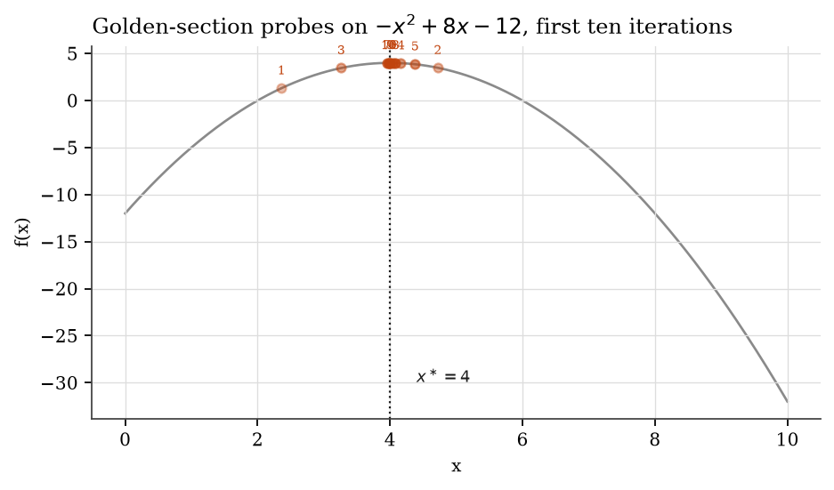
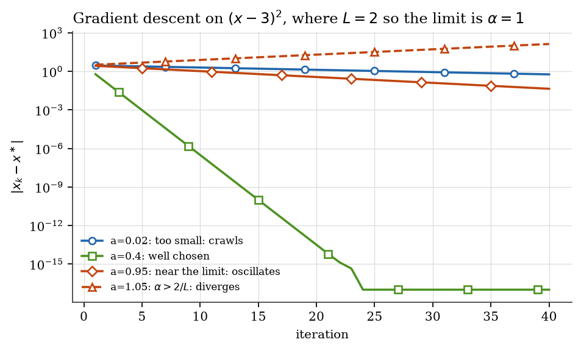

<p align="center">
  
</p>


[](https://github.com/Kemquiros/khumbu/actions/workflows/ci.yml)
[](https://www.python.org/)
[](LICENSE)

**A library you can use, and a lesson you can read.**

The Khumbu icefall is the stretch every Everest ascent must cross. It is dangerous and it is
unavoidable, so the sherpas fix the route and mark it for everyone climbing behind them.

This package does the same for optimisation. **Fifteen algorithms**, from the classical methods of
numerical analysis to the optimisers that train neural networks, implemented so that each run can
be *inspected rather than trusted*: every routine hands back the complete iterate history, and a
run that exhausts its budget without meeting its tolerance says `converged=False` instead of
quietly returning its last point.

They are in one package because they are one subject — and reading them in order is the fastest
way to see that.

## The three chapters

| Chapter | Methods | The question it answers |
|---|---|---|
| **1 · Classical** | `golden_section`, `brent`, `bisection`, `newton_raphson`, `secant`, `backtracking` | What can you promise, and what do you assume to promise it? |
| **2 · Multivariate** | `nelder_mead`, `bfgs`, `conjugate_gradient` | What changes when the problem has more than one dimension? |
| **3 · Modern** | `momentum`, `adam`, `simulated_annealing`, `robbins_monro`, `stochastic_gradient_descent` | Why do the optimisers that train neural networks look the way they do? |

The third chapter is why this package exists. `robbins_monro` is the 1951 theorem whose two
conditions — `Σaₖ = ∞` and `Σaₖ² < ∞` — are the reason learning-rate decay is not a heuristic, and
the same conditions that make temporal-difference learning converge in reinforcement learning.
`simulated_annealing` and `secant` sit a few lines away in the same library. Seeing the chain in
one place is the point.

If you came here to **use** it, jump to [Install](#install).
If you came here to **learn** it, start at [The one idea](#the-one-idea) — the rest of this
document is written to be read in order, with the intuition before the mathematics and the
failure modes stated out loud.



*Distance to the true optimum, same objective, same interval. A straight line on this axis is
linear convergence and its slope is the rate; Newton's two dots at the floor are what quadratic
convergence looks like when the objective is already a parabola. Reproduce with
`python scripts/make_figures.py`.*

The algorithms were first written in 2017 for the undergraduate course *Optimización* at
Universidad de Antioquia. This package is a rewrite; every difference is documented in
[Provenance](#provenance) — including a bug that sat in the original for nine years.

---

## Install

```bash
pip install git+https://github.com/Kemquiros/khumbu
```

No runtime dependencies. Python 3.11 or newer.

```python
from khumbu import Polynomial, golden_section, newton_raphson

f = Polynomial([-12.0, 8.0, -1.0])  # -x² + 8x - 12, ascending order

result = golden_section(f, a=0.0, b=10.0, maximize=True)
print(result.x, result.converged)  # 4.0 True

for step in result.history:  # the whole run, not just the answer
    print(step.iteration, step.x, step.error)
```

---

## The one idea

Every method in this library does the same thing: **it shrinks its uncertainty about where the
optimum is.** They differ only in what they are willing to assume in exchange for shrinking it
faster.

That trade is the entire subject. Assume nothing and you are safe but slow. Assume the function
is smooth, and you can leap — until the assumption fails and you leap off a cliff.

| If you can assume… | You may use… | And you gain | And you risk |
|---|---|---|---|
| nothing but *one optimum in the interval* | golden section | steady, guaranteed shrinking | slow: ~0.618× per step |
| you can compute the **first** derivative | bisection on `f′` | a known error bound *before you run it* | needs a sign change to start |
| you can compute the **second** derivative | Newton–Raphson | doubling correct digits each step | divergence, far from the optimum |
| the gradient is Lipschitz, and you can pick a step | gradient descent | scales to many dimensions | wrong step size ⇒ it blows up |
| the above, plus you may be stuck in a shallow dip | stochastic gradient descent | escapes small basins | never settles exactly |
| your problem is a positive-definite quadratic | conjugate gradient | exact answer in ≤ *n* steps | only for that shape of problem |

**Read that table again after you finish the document.** It is the whole subject compressed, and
it will mean something different the second time.

---

## Choosing a method

```
Do you have f′(x)?
│
├─ No ──────────────────────────────────► golden_section
│                                          (only needs to evaluate f)
└─ Yes
   │
   ├─ Do you also have f″(x)?
   │  │
   │  ├─ Yes, and I have a decent starting guess ──► newton_raphson
   │  │                                              (fastest; verify it converged)
   │  └─ Yes, but my guess could be anywhere ──────► bisection
   │                                                 (slower; cannot fail if bracketed)
   │
   └─ Only f′, and the problem is high-dimensional ─► gradient_descent
                                                      (add noise if it stalls in a dip)

Is your problem literally  A x = b  with A symmetric positive-definite?
└─ Yes ─────────────────────────────────────────────► conjugate_gradient
```

---

## The methods, one at a time

### 1. Golden-section search — *shrinking without derivatives*

**The intuition.** You know the optimum is somewhere in `[a, b]` and that the function has only
one of them there. Probe two interior points. Whichever probe is worse tells you which end of
the interval cannot contain the optimum, so you throw that end away. Repeat.

**The clever part.** Where should the two probes go? Naively you would place them fresh each
round — two new function evaluations per step. But if you place them at

$$x_1 = b - \rho\,(b-a), \qquad x_2 = a + \rho\,(b-a), \qquad \rho = \frac{\sqrt5 - 1}{2} \approx 0.618$$

then after discarding one end, **one of the surviving probes is already in the right place for
the next round.** You pay for one new evaluation instead of two. That is the only reason the
golden ratio appears here — it is the unique number with that self-similarity, and it is worth
sitting with until it feels obvious.



*The first ten probes, converging on the optimum from both sides.*

**What it costs.** The interval shrinks by a factor of 0.618 per step. To gain one decimal digit
you need about five iterations. That is slow, and it is the honest price of assuming nothing.

**What can go wrong.** If the function has *two* minima in `[a, b]`, the method will confidently
converge to one of them and never tell you the other existed. Unimodality is an assumption you
must justify, not a checkbox.

```python
golden_section(lambda x: (x - 3) ** 2, a=-10, b=10)  # → 3.0
```

---

### 2. Bisection on the derivative — *the method that promises before it runs*

**The intuition.** At an optimum the slope is zero. So don't hunt for the optimum — hunt for a
**sign change in the slope**. If `f′(a)` is negative and `f′(b)` is positive, a stationary point
is trapped between them, and no amount of bad luck can let it escape. Cut the interval in half,
keep the half that still straddles zero, repeat.

**The clever part.** You know the error bound *before you start*: after $n$ steps it is at most

$$\frac{b-a}{2^{\,n}}$$

This is the only method here whose accuracy does not depend on what the function looks like.
Need 10 digits over an interval of width 1? That is 34 iterations, guaranteed, always. You can
write that number in a proposal before writing any code.

**What can go wrong.** You need the sign change to begin with. This implementation **raises**
when the derivative does not change sign across the interval, rather than returning an endpoint
and letting you believe it found something:

```python
bisection(lambda x: 2 * (x - 3), a=-5, b=0)
# ValueError: the derivative does not change sign on the interval
```

That refusal is deliberate. A wrong answer that looks plausible costs more than an error.

---

### 3. Newton–Raphson — *fast, and honest about being dangerous*

**The intuition.** Near your current point, pretend the function *is* a parabola — the one that
matches its value, slope and curvature. You can jump to the bottom of a parabola exactly, in
closed form. So jump there, and repeat from the new point.

$$x_{k+1} = x_k - \frac{f'(x_k)}{f''(x_k)}$$

**The clever part.** Close to the optimum, the number of correct digits roughly **doubles each
step**. Three iterations can take you from two digits to sixteen. Nothing else in this library
comes close.

**What can go wrong — and this is the lesson.** The method has *no* guarantee away from the
optimum. If the curvature is small, the step is enormous and lands somewhere unrelated. If the
curvature is zero, the step is undefined:

```python
newton_raphson(lambda x: x, lambda x: 0.0, x0=1.0)
# ZeroDivisionError: vanishing second derivative at x=1
```

The 2017 version of this code responded to that case by drawing a *fresh random starting point*
and trying again. It looked robust and it was not: the failure was real, and hiding it meant the
run reported success on a method that had broken down. **Raising is the improvement.**

A quadratic objective, being already a parabola, is solved by the very first iterate — the test
suite asserts exactly that.

---

### 4. Gradient descent — *the one that scales, and the one you must tune*

**The intuition.** Stand on the surface, feel which way is downhill, take a step that way. Repeat.

$$x_{k+1} = x_k - \alpha\,f'(x_k)$$

Nothing here is one-dimensional in spirit: this is the method that survives into a million
dimensions, and it is why it underlies essentially all of modern machine learning.

**The whole difficulty is $\alpha$.** If the gradient is $L$-Lipschitz, convergence needs

$$\alpha < \frac{2}{L}$$

Too small and you crawl. Too large and the iterates **grow without bound** — the method does not
merely slow down, it explodes. Try it:

```python
result = gradient_descent(lambda x: (x - 3) ** 2, lambda x: 2 * (x - 3), x0=0.0, learning_rate=1.5)
print(result.converged)  # False — and it says so
```



*The same objective and the same starting point, four step sizes. Below the limit the method
converges linearly; at $\alpha = 0.4$ it reaches machine precision in about twenty-four steps;
above $\alpha = 1$ the error **grows** — the dashed line — and no amount of patience recovers it.*

For this objective $L = 2$, so any step above 1.0 diverges. The library performs no line search:
choosing $\alpha$ is your job, and the result tells you the truth about how it went. A library
that silently returned the last iterate here would be lying to you.

**The stochastic variant.** Add Gaussian noise to the gradient and the iterate can rattle its way
out of a shallow dip that would trap the deterministic method. The noise is annealed as
$\sigma/\sqrt{k}$ — loud early, quiet later — which is what allows it to settle at all.

It also takes a `seed`. **An unseeded stochastic result cannot be reproduced by whoever reads
your paper**, which makes it evidence of nothing.

---

### 5. Conjugate gradient — *when the shape of the problem is a gift*

**The intuition.** Solving $Ax = b$ for symmetric positive-definite $A$ is the *same thing* as
minimizing the bowl

$$\tfrac12\,x^\top A x - b^\top x$$

Steepest descent on a stretched bowl zig-zags: each step undoes part of the last one. Conjugate
gradient chooses directions that are **$A$-orthogonal**, so progress made along one direction is
never spoiled by the next.

**The clever part.** With $n$ mutually conjugate directions in $n$ dimensions, you have covered
the whole space. In exact arithmetic the method **terminates in at most $n$ steps** — not
converges, *terminates*. It is a direct method wearing the clothes of an iterative one.

**What can go wrong.** All of it depends on $A$ being positive definite. This implementation
checks the curvature along each search direction and raises if it is not, because the alternative
is a silently meaningless answer.

---

## Reading a result

Every function returns the same object, and the point of it is that you can audit the run:

```python
result.x  # best point found
result.fx  # objective there
result.iterations  # how many steps were actually taken
result.converged  # did it MEET its tolerance, or just run out of budget?
result.history  # every iterate: (iteration, x, fx, error)
```

`converged` is the field to look at first. It is the difference between *"the method worked"* and
*"the method stopped"*, and a great deal of published computational work confuses the two.

Plot `[step.error for step in result.history]` on a log scale: you will *see* the linear decay of
golden section, the exact halving of bisection, and the sudden collapse of Newton. That single
plot teaches convergence rates better than any table, including the one above.

---

## Development

```bash
git clone https://github.com/Kemquiros/khumbu && cd optimizacion
pip install -e ".[dev]"

pytest                            # 24 tests, all against analytically known optima
ruff check .                      # lint
mypy                              # strict type checking
python scripts/make_figures.py    # regenerate the figures above from the library itself
```

CI runs all three on Python 3.11, 3.12 and 3.13.

Tests assert *mathematical properties*, not just outputs: that bisection halves its bracket
exactly, that golden section shrinks monotonically, that Newton is exact on a quadratic at the
first iterate, that a seeded stochastic run is reproducible. If you extend the library, extend it
in that spirit.

---

## Provenance

The original coursework is preserved as an annotated git tag rather than a directory, so the
repository reads as a tool while the evidence stays one command away:

```bash
git checkout coursework-2017
```

Those scripts are Python 2, interactive-only, and import the `compiler` module removed in
Python 3.0. Every claim in the table below can be checked against them.

| 2017 | Now | Why |
|---|---|---|
| Python 2, `compiler.parse`, `raw_input` | Python 3.11+ | `compiler` was removed in Python 3.0; the scripts run on no supported interpreter |
| `eval()` on a string typed by the user | callables passed as arguments | arbitrary code execution |
| Algorithms interleaved with `matplotlib` and `input()` | pure functions, no I/O | nothing could be imported, reused or tested |
| Stopping flag misspelled `termin` for `termina` | fixed, with a regression test | **the loop never terminated** — nine years unnoticed |
| Newton drew a fresh random start when `f″ = 0` | raises `ZeroDivisionError` | retrying concealed a genuine breakdown |
| Unseeded `random` in the stochastic method | explicit `seed` | an unseeded result is unreproducible |
| No convergence signal | `converged: bool` | budget exhaustion was indistinguishable from success |

Original coursework: John Edisson Tapias Zarrazola, Universidad de Antioquia, 2017.

## Where to go next

- Nocedal & Wright, *Numerical Optimization* — the standard reference; chapters 2–5 cover
  everything above with proofs.
- Boyd & Vandenberghe, *Convex Optimization* — free online; read it for *why* convexity is the
  dividing line between methods that promise and methods that hope.
- Shewchuk, *An Introduction to the Conjugate Gradient Method Without the Agonizing Pain* — the
  clearest thing ever written about §5, and free.

## Citation

See [`CITATION.cff`](CITATION.cff), or:

> Tapias Zarrazola, J. E. *khumbu: classical one-dimensional numerical optimization methods.*
> Version 1.0.0, 2026. https://github.com/Kemquiros/khumbu

## License

MIT — see [`LICENSE`](LICENSE).
