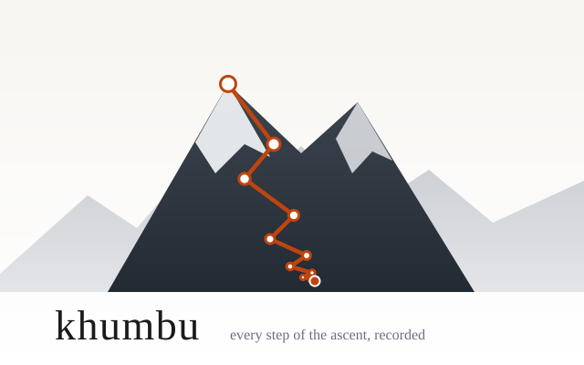
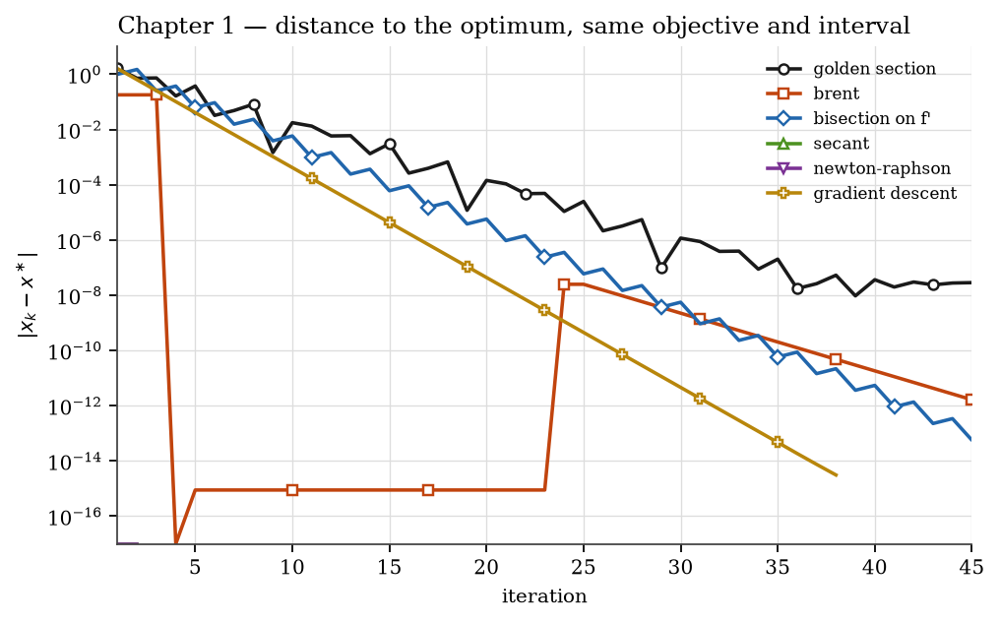
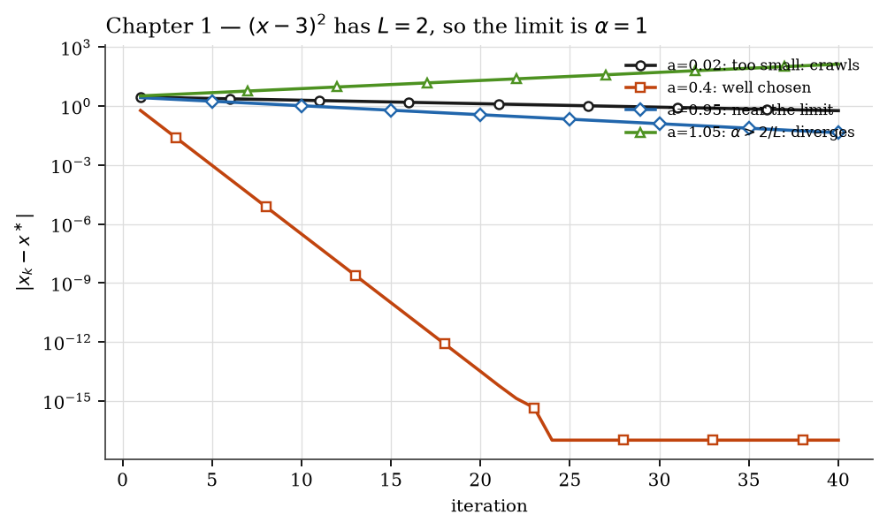
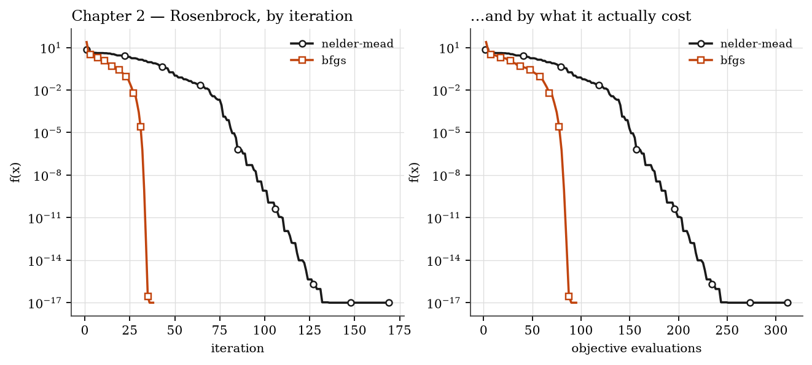
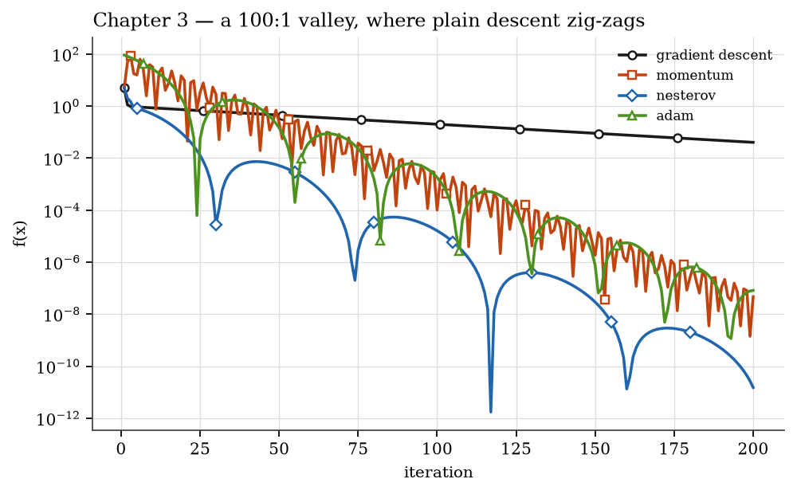
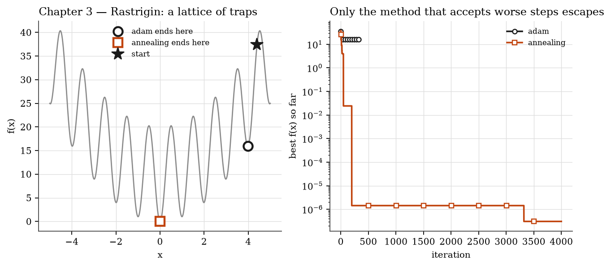
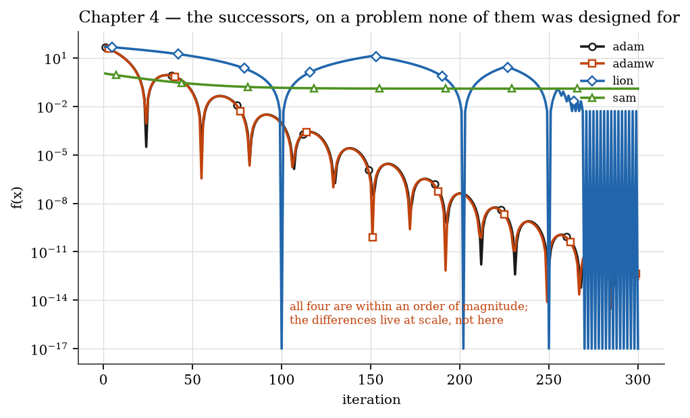
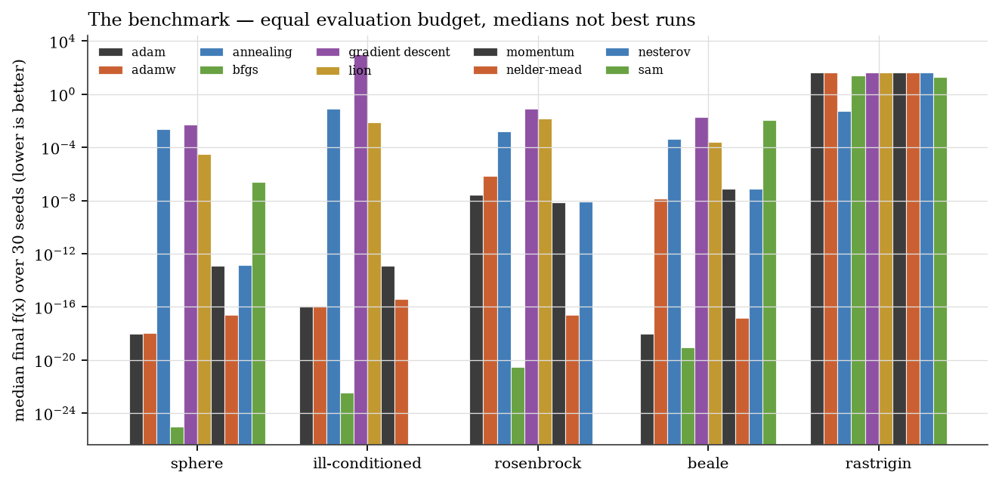

<p align="center">
  
</p>

<p align="center">
  <a href="https://github.com/Kemquiros/khumbu/actions/workflows/ci.yml"></a>
  
  
  
</p>

The Khumbu icefall is the stretch every Everest ascent must cross. It is dangerous and it is
unavoidable, so the sherpas fix the route and mark it for everyone climbing behind them.

**This package does the same for an optimisation run.** Nineteen algorithms — from the classical
methods of numerical analysis to the optimisers proposed in 2024 to replace Adam — each returning
the *full trail* of its ascent rather than only the summit, and each saying plainly whether it
converged or merely ran out of budget.

```bash
pip install git+https://github.com/Kemquiros/khumbu
```

```python
from khumbu import bfgs, adam, simulated_annealing

result = bfgs(f, gradient, x0)
result.x            # the answer
result.converged    # did it MEET its tolerance, or just stop?
result.evaluations  # what it cost — the only fair axis for comparison
result.history      # every step it took
```

No runtime dependencies. Python 3.11+.

---

## Contents

| | |
|---|---|
| [**Chapter 1 — Classical**](#chapter-1--classical) | golden section · Brent · bisection · Newton–Raphson · secant · Armijo |
| [**Chapter 2 — Multivariate**](#chapter-2--multivariate) | Nelder–Mead · BFGS · conjugate gradient |
| [**Chapter 3 — Modern**](#chapter-3--modern) | momentum · Nesterov · Adam · SGD · simulated annealing · Robbins–Monro |
| [**Chapter 4 — Frontier**](#chapter-4--frontier) | AdamW · Lion · SAM · Muon |
| [**The benchmark**](#the-benchmark) | 10 methods × 5 problems × 30 seeds, one fixed budget |
| [**📖 The methods, one card each**](docs/METHODS.md) | **equation · domain · convergence · cost · how it fails** — the mini-class |

Read in order, it is one argument: **every method buys speed by assuming something, and the
assumption is the thing to check.**

If you want the reference rather than the story — every method's equation, the domain it works on,
its convergence rate, what one step costs, and precisely **how it fails** — that is
[**`docs/METHODS.md`**](docs/METHODS.md).

---

## Chapter 1 — Classical

*What can a method promise, and what does it assume in order to promise it?*

| Function | Needs | Convergence | Guarantee |
|---|---|---|---|
| `golden_section(f, a, b)` | unimodality only | linear, ratio 0.618 | the bracket always shrinks |
| `bisection(df, a, b)` | a sign change in `f′` | linear, ratio 1/2 | error `(b−a)/2ⁿ`, **known before you run** |
| `brent(f, a, b)` | unimodality | superlinear when smooth | keeps golden section's floor |
| `newton_raphson(df, d2f, x₀)` | `f″ ≠ 0` nearby | **quadratic** | none globally — may diverge |
| `secant(df, x₀, x₁)` | `f′` only | superlinear, order **φ ≈ 1.618** | none globally |
| `backtracking(f, df, x, d)` | a descent direction | — | sufficient decrease, guaranteed |



A straight line on this axis is linear convergence and its slope is the rate. Newton's two markers
at the floor are quadratic convergence on an objective that is already a parabola: exact at the
first iterate, with a second step spent only confirming it.

**The secant's order of convergence is the golden ratio** — the same φ that governs golden-section
search, arrived at from a completely unrelated derivation. It needs no second derivative, so when
`f″` is expensive it wins on total work while losing on iteration count.

**Brent is what production libraries actually run.** It takes a parabolic step *only when that step
is provably sensible* — inside the bracket, and less than half the step before last — and falls
back to golden section otherwise. The safeguard, not the interpolation, is the idea worth keeping.

### The step size question

`gradient_descent` leaves α to you, and choosing it wrongly is how the method fails:



For `(x−3)²` the gradient is 2-Lipschitz, so convergence needs α < 1. Below it the method
converges linearly; at 0.4 it reaches machine precision in twenty-four steps; above it the error
**grows**, and no patience recovers it. The run reports `converged=False` rather than pretending.

`backtracking` answers the question: start optimistic and halve until

$$f(x + t d) \le f(x) + c\,t\,f'(x)\,d$$

Any `t` satisfying this makes real progress. That single condition turns descent from a method
that needs tuning into one that does not.

---

## Chapter 2 — Multivariate

*What changes when there is more than one dimension?*

**`nelder_mead(f, x₀)`** keeps `n+1` points and reflects the worst through the centroid of the
rest. Use it on a black box — a simulation, an experiment, legacy code nobody can differentiate.
It has **no convergence guarantee above one dimension**; that is a known result, not a defect here,
and it is stated in the docstring rather than hidden.

**`bfgs(f, ∇f, x₀)`** reaches Newton's speed while never forming a Hessian. It *accumulates* an
inverse-Hessian approximation from gradients already paid for, using the secant condition — the
curvature between two points is visible in how the gradient changed between them. That is
Chapter 1's secant method generalised, and it is why BFGS rather than Newton is what most
optimisers run.



The same two runs, twice. On the left by iteration; on the right by objective evaluations, which
is what they cost. Nelder–Mead spends several evaluations per iteration and BFGS spends a line
search — comparing them by iteration count would be meaningless.

---

## Chapter 3 — Modern

*Why do the optimisers that train neural networks look the way they do?*

**`momentum`** accumulates velocity, so components that keep pointing the same way reinforce and
oscillating ones cancel. It is the cure conjugate gradient applies to quadratics, obtained cheaply
and without requiring one. With `nesterov=True` the gradient is measured at the look-ahead point,
so the method brakes *before* overshooting instead of after.



**`adam`** keeps running averages of the gradient and its square, and divides one by the root of
the other, giving every coordinate its own effective step size.

> **Why the bias correction exists** — the part most users cannot explain. Both averages start at
> zero, so at step 1 the first moment holds only `(1 − β₁)` of the true gradient: about a tenth.
> Dividing by `1 − β₁ᵏ` undoes exactly that shrinkage. Without it the earliest steps are far too
> small and the run wastes its opening. A test pins this to within 5%.

**`simulated_annealing`** accepts a worse candidate with probability `exp(−Δ/T)` and cools
geometrically, with the rate **derived** from the schedule rather than guessed:

$$\alpha = \left(T_\text{final}/T_\text{initial}\right)^{1/(n-1)}$$

the same construction used in SIROA (2018). It is the only method here that can leave a local
minimum, and it pays for that with no convergence guarantee at all:



Adam falls into the nearest trap and stays there. Annealing crosses the whole lattice.

**`robbins_monro`** is the 1951 theorem underneath all of it. A root of a function observable only
through noise can still be found, provided

$$\sum a_k = \infty \quad\text{(able to travel any distance)} \qquad \sum a_k^2 < \infty \quad\text{(noise averages out)}$$

`aₖ = c/kᵖ` satisfies both exactly when `0.5 < p ≤ 1`. **Those two conditions are the reason
learning-rate decay is not a heuristic** — and they are the same conditions under which
temporal-difference learning converges in reinforcement learning. Classical numerical analysis and
RL turn out to be one subject, and here they are one import apart.

---

## Chapter 4 — Frontier

*Everything published to replace Adam — and what it is actually worth.*

**`adamw`** decouples weight decay from the gradient. The distinction is subtle and it matters:
classical L2 adds `λx` to the gradient, and Adam then divides that term by `√v` along with
everything else — so **the effective regularisation depends on each coordinate's gradient
history**. A rarely-updated parameter gets decayed far more than a busy one, which nobody
intended. AdamW applies the decay to the parameter directly.

**`lion`** takes the **sign** of an interpolated momentum. Two consequences follow, and they are
the whole method: half of Adam's optimiser memory (one buffer, not two), and every coordinate moves
by exactly `lr` regardless of its gradient's size. That makes Lion insensitive to gradient scale
and *very* sensitive to the learning rate — published recipes use roughly a tenth of Adam's.

**`sharpness_aware`** (SAM) minimises the worst value in a ball around the point rather than the
value at the point, so it prefers flat minima to sharp ones. It costs **two gradients per step**,
and the benchmark charges it accordingly.

**`muon`** treats a parameter as a *matrix* and replaces its momentum by the nearest orthogonal
matrix, so no singular direction dominates the update. The orthogonalisation uses a Newton–Schulz
iteration rather than an SVD, which is what keeps it affordable.

> **It does not converge to an orthogonal matrix, and that is deliberate.** The quintic
> coefficients are tuned so singular values land in a band around one — roughly [0.7, 1.3] — as
> fast as possible. Iterating further makes the result *oscillate* inside that band rather than
> sharpen, which two tests document so nobody "fixes" it by adding steps.



### What the literature actually found

| Claim | Measured |
|---|---|
| Matrix methods beat AdamW | ~1.3× fewer steps below 520M parameters |
| …and it scales | **decays to ~1.1× at 1.2B parameters** |
| Muon is faster | **1.45× more wall-clock per step**; SOAP 1.72× |
| Reported 2× speedups | *"many simply reflect a weak baseline"* |

Source: [*Fantastic Pretraining Optimizers and Where to Find Them*](https://arxiv.org/abs/2509.02046) (2025).

**A well-tuned AdamW is hard to beat**, and most papers claiming otherwise were not tuning it.
That is precisely why this package ships a benchmark instead of a leaderboard.

---

## The benchmark

```bash
python -m khumbu.benchmark
```

**The protocol, stated before any result:**

- **Fixed evaluation budget, not iteration count.** SAM pays two gradients per step and is charged.
- **Thirty seeds**, each with a perturbed starting point. A single run is an anecdote.
- **Median and interquartile range** — never the best run. Reporting the best seed is how methods
  are made to look better than they are, and the table shows it beside the median so you can see
  the gap.
- **Calibration seeds disjoint from evaluation seeds**, so the reported number is not the one that
  was tuned on. A test asserts the two sets do not intersect.
- **Gradients verified against finite differences**, because a wrong gradient would silently
  invalidate everything.



### Two results worth stating plainly

**BFGS wins nearly everything, and by a distance.** On Beale it reaches `9×10⁻²⁰` in **42
evaluations**, while Adam needs 959 to reach `9×10⁻¹⁹` and AdamW spends the full 2000 to reach
`10⁻⁸`. A second-order method with a line search beats the fashionable first-order family by
fifteen orders of magnitude at a fiftieth of the cost.

**On Rastrigin, every gradient method fails identically.** Adam, AdamW, momentum, Nesterov, Lion
and plain descent all land on `40.79` — the same nearby trap. Annealing reaches `0.059`. No amount
of adaptivity substitutes for the ability to accept a worse step.

### And the caveat that makes the benchmark honest

**These are smooth, low-dimensional, deterministic problems — which is not what Adam, Lion, SAM or
Muon were designed for.** They exist for noisy gradients over millions of parameters, where
per-coordinate scaling and memory footprint decide everything and a Hessian approximation is
unaffordable. Concluding "Lion loses to BFGS" from this table would be exactly the error the
Chapter 4 literature review warns about.

The benchmark that flatters your method is the one you must not run. This one is included so the
package's own claims can be checked — including the ones it cannot support.

---

## Development

```bash
git clone https://github.com/Kemquiros/khumbu && cd khumbu
pip install -e ".[dev,figures]"

pytest                            # 75 tests
ruff check . && mypy              # lint and strict typing
python scripts/make_figures.py    # regenerate every figure above from the library
python -m khumbu.benchmark        # regenerate the table
```

Tests assert *properties*, not outputs: that bisection halves its bracket exactly, that Newton is
exact on a quadratic at the first iterate, that Lion moves every coordinate the same distance
regardless of gradient size, that a seeded stochastic run reproduces, that Newton–Schulz compresses
singular values without converging. Extend the library in that spirit.

---

## Provenance

The 2017 coursework this grew from — the course *Optimización* at Universidad de Antioquia — is
preserved as an annotated tag rather than a directory:

```bash
git checkout coursework-2017
```

Those scripts are Python 2, interactive-only, import the `compiler` module removed in Python 3.0,
apply `eval()` to user input, and contain a deterministic gradient-descent loop whose stopping flag
was misspelled — so **it never terminated**. Every one of those is documented, and the loop bug is
pinned by a regression test.

## Citation

> Tapias Zarrazola, J. E. *khumbu: optimization from golden section to Adam, with the full trail
> of every run.* Version 2.1.0, 2026. https://github.com/Kemquiros/khumbu

See [`CITATION.cff`](CITATION.cff).

## Further reading

- Nocedal & Wright, *Numerical Optimization* — chapters 2–6 cover Chapters 1 and 2 with proofs.
- Boyd & Vandenberghe, *Convex Optimization* — free online; why convexity divides methods that
  promise from methods that hope.
- Shewchuk, *An Introduction to the Conjugate Gradient Method Without the Agonizing Pain* — free,
  and the clearest thing ever written on the subject.
- Robbins & Monro (1951), *A Stochastic Approximation Method* — the theorem under Chapter 3.
- [*Fantastic Pretraining Optimizers and Where to Find Them*](https://arxiv.org/abs/2509.02046) —
  the honest accounting of Chapter 4.

## License

MIT — see [`LICENSE`](LICENSE).
